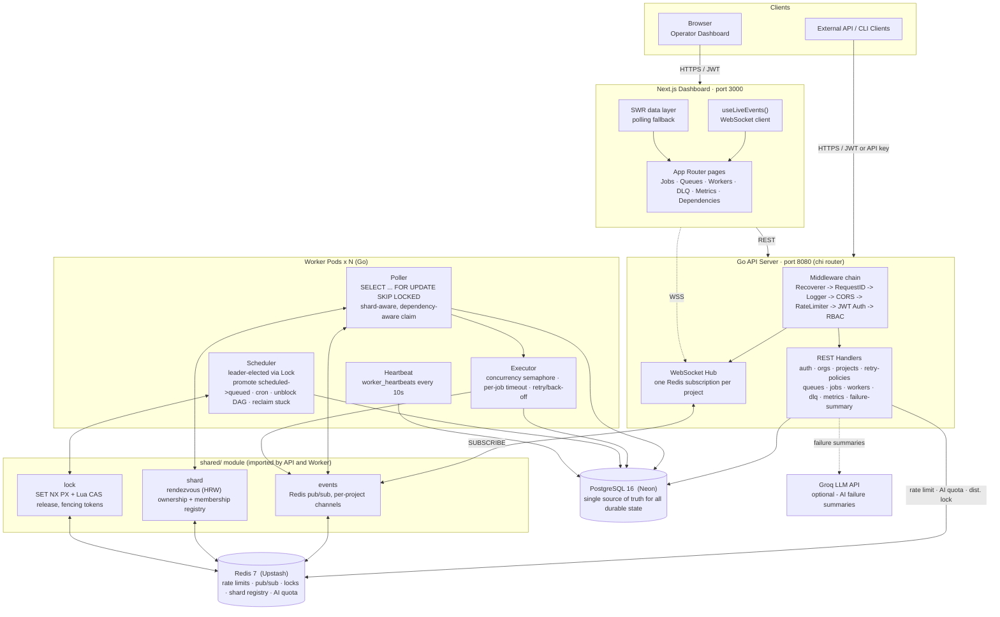

# dis-job-queue

A production-inspired distributed job scheduling platform. It executes asynchronous
background jobs across multiple worker processes with priority scheduling, configurable
retry policies, cron recurrence, workflow dependencies, queue sharding, a dead-letter
queue, role-based access control, and a real-time operator dashboard.

Full REST/WebSocket API reference: **[API.md](API.md)**.

---

## Table of Contents

- [Quick Start](#quick-start)
- [System Architecture](#system-architecture)
- [Entity-Relationship Diagram](#entity-relationship-diagram)
- [How It Works](#how-it-works)
- [Frontend Dashboard](#frontend-dashboard)


---

## Quick Start

**Requires:** Go 1.25+, Node 20+, and Docker (or an existing Postgres 16 + Redis 7,
e.g. Neon + Upstash).

**1. Clone and configure**
```bash
git clone <repo-url> && cd dis-job-queue
cp .env.example .env   # set DATABASE_URL, JWT_SECRET, PROJECT_ID
```

**2. Database + Redis** (pick one)
```bash
# a) local, automatic - leave DATABASE_URL/REDIS_URL at their .env.example
#    defaults; step 4 starts Postgres/Redis via Docker for you
# b) fully containerized - everything, incl. Postgres/Redis, in containers
docker compose up
# c) remote - point DATABASE_URL/REDIS_URL at an existing instance
```

**3. Apply the schema** (first run only, skip for path b, it self-bootstraps)
```bash
./scripts/dev.sh --migrate
```
Needs the `migrate` CLI once:
`go install -tags 'postgres' github.com/golang-migrate/migrate/v4/cmd/migrate@latest`

**4. Run**
```bash
make dev
```
Go and npm packages install themselves on first run, nothing to do manually. Starts
the API (`:8080`), a worker, and the dashboard (`:3000`) in one terminal; Ctrl-C stops
everything.

```
   dis-job-queue dev 
   api    http://localhost:8080
   web    http://localhost:3000
   worker 1 x queues: default,email,notifications
  
```

**5. Verify API**
```bash
curl localhost:8080/health   
```
Then open `http://localhost:3000`.

### Variations

| Command | What it runs |
| --- | --- |
| `make dev` | API + worker + dashboard |
| `make dev-watch` | same, rebuilds/restarts Go services on any `.go` change |
| `make dev-api` · `make dev-worker` · `make dev-web` | a single service |
| `./scripts/dev.sh --workers 3` | three worker processes, same queues |
| `./scripts/dev.sh --migrate` | apply migrations before starting |
| `./scripts/dev.sh --kill-port` | free `:8080` / `:3000` if held |
| `PORT=8081 WEB_PORT=3001 make dev` | different ports |
| `docker compose up` | everything containerized, incl. Postgres/Redis |

`./scripts/dev.sh --help` lists every flag.

---

## System Architecture



### Layers, in order

1. **Clients.** The browser dashboard and any external API/CLI client speak the same
   authenticated REST API, there is no separate internal API.
2. **Frontend (Next.js, port 3000).** Server-rendered pages backed by an SWR polling
   layer for baseline freshness, augmented by a native `WebSocket` connection
   (`useLiveEvents`) that pushes targeted revalidations the moment something changes,
   so the UI updates in well under a second instead of waiting for the next poll tick.
3. **API server (Go, chi router, port 8080).** A single stateless process (horizontally
   scalable behind a load balancer) that terminates every client request. It never
   executes a job itself, its role is validation, authorization, persistence, and
   relaying management operations; execution is entirely the worker pool's
   responsibility.
4. **`shared/` module.** Three contracts that the API and every worker import from the
   same package, so they can never drift out of sync with each other:
   - `events`, a fire-and-forget Redis pub/sub wrapper used both to push WebSocket
     updates to browsers and to wake idle workers the instant a job becomes claimable.
   - `lock`, a Redis distributed lock (`SET NX PX` acquire, a Lua compare-and-swap
     release so a stale holder can never delete a successor's lock, monotonic fencing
     tokens, and an auto-renewing `Guard` for long-lived leadership).
   - `shard`, a rendezvous-hashing (HRW) shard-ownership calculation plus a
     TTL-pruned Redis registry of live workers, used to split high-volume queues across
     the worker pool without a central coordinator.
5. **Worker pool (Go, N replicas).** Each pod runs four concurrent subsystems (poller,
   executor, scheduler, heartbeat), detailed in [How It Works](#how-it-works).
6. **PostgreSQL (Neon).** The single source of truth for every piece of durable state:
   job records, queue configuration, worker health, execution logs, dead-letter
   entries, auth tokens, and AI summaries. The system survives a full Redis restart
   with zero data loss, because nothing durable is ever stored anywhere else.
7. **Redis (Upstash).** Deliberately kept narrow and entirely disposable: rate-limit
   counters, the pub/sub event bus, distributed locks, the shard membership registry,
   and the AI-summary quota counter. Every one of these is either advisory or
   self-healing when Redis is unavailable (see the degraded-mode notes on
   [sharding](#queue-sharding-and-distributed-locking) below), so operators can reason
   about correctness by looking at Postgres alone.
8. **Groq LLM API (optional).** Called only from `POST /jobs/{id}/failure-summary`, and
   only when `GROQ_API_KEY` is configured; every other code path is fully functional
   with it absent.

---

## Entity-Relationship Diagram


### Design rationale

**Normalization.** The schema is in third normal form throughout: queue configuration
(`retry_policies`) is factored out of `queues` so one policy can be shared by many
queues; job state (`jobs`), attempt history (`job_executions`), and structured log
output (`job_logs`) are three separate tables rather than one wide table, because they
have different write patterns (one row per job vs. one row per attempt vs. many rows
per attempt) and different retention needs. `job_dependencies` is a pure join table
expressing a many-to-many self-relationship on `jobs`, with a `CHECK` constraint
(`job_id <> depends_on_job_id`) that makes a self-dependency impossible at the database
level rather than relying on application code to catch it.

**Primary keys.** Every table uses a `UUID` surrogate key (`gen_random_uuid()`) except
the two purely additive, high-volume log tables (`worker_heartbeats`, `job_logs`),
which use a `BIGSERIAL` for cheaper sequential inserts and natural chronological
ordering. `organization_members` and `job_dependencies` use composite primary keys
(`(org_id, user_id)`, `(job_id, depends_on_job_id)`) since the pair itself is the
natural identity of the row, an additional surrogate key would only add an unused
index.

**Foreign keys and cascading.** Every foreign key is declared explicitly with an
`ON DELETE` policy chosen per relationship rather than a blanket default:
- `CASCADE` where the child has no independent meaning once the parent is gone:
  `organization_members`, `projects`, `queues`, `jobs`, `job_executions`, `job_logs`,
  `job_dependencies`, `dead_letter_queue`, `job_failure_summaries`, `refresh_tokens`,
  `worker_heartbeats`. Deleting an organization cleanly removes everything beneath it
  in one statement, with no orphaned rows possible.
- `SET NULL` where the child clearly outlives the parent and losing the reference is
  just losing an attribution, not the row's meaning: `queues.retry_policy_id` (a queue
  keeps running with the platform's default back-off if its named policy is deleted),
  `jobs.claimed_by` (a job is not deleted just because the worker that touched it was
  deregistered), `job_executions.worker_id`, `dead_letter_queue.resolved_by`,
  `job_failure_summaries.generated_by`.

**Indexes.** The two indexes that matter most for correctness under load both back the
worker's hot-path queries directly:
- `idx_jobs_poll` on `(queue_id, shard, run_at, priority DESC) WHERE status='queued'`
  is a **partial** index, it only covers rows the poller can actually claim, so it
  stays small and fast no matter how many millions of `completed` rows accumulate in
  the same table. This is the index `FOR UPDATE SKIP LOCKED` walks on every poll tick.
- `idx_jobs_reclaim` on `claimed_at WHERE claimed_at IS NOT NULL AND status IN
  ('claimed','running')` lets the scheduler's stuck-job sweep find abandoned claims
  (a worker that crashed mid-execution) without scanning the whole table.

Every other index follows the same principle, scoped to exactly the query it serves:
`idx_jobs_status` for the dashboard's status filters, `idx_jobs_batch` (partial, `WHERE
batch_id IS NOT NULL`) for batch lookups, `idx_jobs_scheduled` (partial, `WHERE
status='scheduled'`) for the cron/delay promotion sweep, `idx_executions_job` and
`idx_logs_job` for a job's detail page, `idx_workers_live` (partial, `WHERE
status='active'`) for the "who's alive right now" dashboard query, and `idx_dlq_pending`
(partial, `WHERE resolved_at IS NULL`) for the DLQ inbox view.

**Performance considerations.** `jobs.status` is a Postgres `ENUM`
(`job_status`), which is both smaller on disk than `TEXT` and self-documenting as a
`CHECK` constraint that can never drift. Every partial index above trades a small
amount of write overhead (Postgres must decide whether a new row's predicate matches)
for a much smaller, much hotter index that stays fast as the table grows into the
millions of historical rows, exactly the shape a job queue's `jobs` table takes over
time: a small live working set sitting on top of a large cold archive.

---

## How It Works

### Design Philosophy

PostgreSQL is the single source of truth for every piece of durable state in the
system. Redis is intentionally kept narrow, purely coordination and caching, and is
never the only place any fact lives. This means the system survives a Redis restart
with no data loss, and operators can reason about system state by querying one
relational database rather than reconciling two stores.

### Resource Hierarchy

Everything is scoped to a multi-tenant hierarchy:

```
Organization -> Project -> Queue -> Job
```

An **Organization** groups related teams or customers. A **Project** belongs to one
organization and namespaces work within it, and carries its own API key. A **Queue**
belongs to a project and carries scheduling configuration: priority, concurrency limit,
an optional retry policy, and an optional shard count. A **Job** is the unit of work: it
belongs to a queue, holds a JSON payload, a numeric priority (1-10, higher runs first),
an optional idempotency key, an optional set of upstream dependencies, and a status that
advances through the [job lifecycle FSM](API.md#job-status-fsm).

### Authentication & Authorization

Clients authenticate against `POST /auth/login`, receiving a short-lived JWT access
token and a long-lived, rotating refresh token persisted in Postgres so it can be
revoked server-side. Every protected route then re-derives the caller's role for that
specific resource from `organization_members` on every request (see
[Authorization (RBAC)](API.md#authorization-rbac) in the API docs for the full
four-role model), so removing someone from an organization takes effect on their very
next request rather than waiting for their access token to expire.

A Redis-backed sliding-window rate limiter (200 requests/minute per IP by default) sits
in the middleware chain ahead of authentication, so even unauthenticated abuse is shed
at the edge before it reaches a handler.

### API Server

The Go API server runs on port 8080 using the `chi` router. Requests pass through, in
order: **Recoverer** (panics become a `500`, not a crashed process), **RequestID**,
**Logger** (method, path, latency, status, with the WebSocket `?token=` query parameter
redacted), **CORS** (an explicit origin allowlist, not a wildcard, once
`CORS_ORIGINS` is set), the **rate limiter**, **JWT auth**, and finally the
per-route **RBAC** check. Handlers talk to Postgres through a single shared `pgxpool`
connection pool, bounding the number of open connections regardless of request
concurrency.

### Job Lifecycle (Status FSM)

```
scheduled --(due)--> queued --(claimed)--> claimed --(handler starts)--> running
                        ^                                                    |
     blocked --(deps completed)--+                                          |
                                                                              v
queued/scheduled/blocked --(cancel)--> cancelled                completed / failed / dead
blocked --(upstream job died permanently)--> cancelled
failed --(attempts remain)--> queued  ·  failed --(attempts exhausted)--> dead
```

| Status | Meaning |
| --- | --- |
| `scheduled` | Future-dated, or a cron job waiting for its next tick |
| `blocked` | Waiting on one or more incomplete `depends_on` jobs |
| `queued` | Eligible for claim right now |
| `claimed` | Reserved by a worker (`FOR UPDATE SKIP LOCKED`), not executing yet |
| `running` | Executing inside a worker goroutine under its `timeout_secs` deadline |
| `completed` | Finished successfully (a cron job is immediately re-armed to `scheduled`) |
| `failed` | Errored with attempts remaining; requeued after a back-off delay |
| `dead` | Attempts exhausted; a `dead_letter_queue` row is written in the same transaction |
| `cancelled` | User-cancelled, or auto-cancelled because a dependency reached a terminal failure |

State transitions are written as atomic updates inside the same transaction that claims
or closes the job, so there is no window in which a job's status and its side effects
(a DLQ row, an execution row) can disagree.

### Worker Pods

Each worker pod is an independent Go process running four concurrent subsystems.

**Poller + Executor.** The poller issues a single `UPDATE ... WHERE ... FOR UPDATE
SKIP LOCKED RETURNING ...` that atomically claims up to as many jobs as the executor
has free capacity for. The predicate is shard-aware (a pod only claims from queues, or
shards of queues, it owns) and dependency-aware (`NOT EXISTS` an incomplete upstream
job) in the same statement, so a job can never be claimed before its dependencies are
satisfied, even if the `blocked` status bookkeeping is momentarily behind. `FOR UPDATE
SKIP LOCKED` is the entire concurrency mechanism: when multiple pods race for the same
row, Postgres grants the lock to exactly one and the rest silently move on to the next
candidate, no application-level locking, no separate queue broker, no wasted round
trips. Claimed jobs are handed to the **Executor**, which runs each inside its own
goroutine under a **concurrency semaphore** (bounding how many run in parallel per pod)
and a **per-job `context.WithTimeout`**. On failure with attempts remaining, it computes
the next retry delay from the queue's back-off policy (fixed, linear, or exponential,
each capped at `max_delay_ms`) and requeues; on final failure it writes the job to
`dead` and inserts a `dead_letter_queue` row in the same statement.

**Scheduler.** A leader-elected goroutine (leadership held via the `shared/lock`
distributed lock, so exactly one pod runs it per project at a time) wakes every five
seconds and runs an idempotent sweep: promote due `scheduled` jobs to `queued`, compute
the next run for recurring cron jobs, unblock any `blocked` job whose dependencies just
completed, cancel any `blocked` job whose upstream died permanently, and reclaim jobs
stuck in `claimed`/`running` past a grace period (a pod that crashed mid-execution).
Because every one of these statements is itself idempotent and safe to run
concurrently, losing Redis does not stop the sweep, it simply runs unguarded on every
pod instead of on one elected leader, trading a little redundant work for continued
availability.

**Heartbeat.** Each pod writes a `worker_heartbeats` row every ten seconds (hostname,
PID, running/completed counts). The API's `/workers` and `/workers/{id}` endpoints, and
the `active_workers` metric, only count a worker as live if its heartbeat is fresher
than two minutes, so a pod that crashed without deregistering is correctly reported as
gone rather than lingering forever.

### Queue Sharding and Distributed Locking

A queue's `shard_count` (1-64, default 1) splits its jobs across the worker pool using
rendezvous hashing (HRW) rather than a fixed modulo, so adding or removing a worker
reshuffles the minimum possible number of shard assignments instead of nearly all of
them. Shard ownership is tracked in a Redis set with a TTL, refreshed on a heartbeat; if
that registry is ever unreachable, every worker falls back to claiming **every** shard
rather than none, `FOR UPDATE SKIP LOCKED` still guarantees no duplicate execution, so
sharding is purely a contention-reduction optimization and never a correctness
mechanism. The same pattern governs scheduler leadership: losing the lock means running
unguarded, not stalling.

### Event-Driven Wake-Ups and Live Updates

Every state-changing write (`job.enqueued`, `job.completed`, `queue.paused`, and so on)
is published to a per-project Redis channel. Workers subscribe to nudge their own
poller immediately instead of waiting for the next tick, cutting enqueue-to-pickup
latency from up to `POLL_INTERVAL` down to milliseconds while keeping the ticker itself
as a safety net for any dropped message. The API's WebSocket hub subscribes the same
way to push the identical events straight to connected dashboard clients (see
[Live Events](API.md#live-events-websocket)); polling remains fully functional on its
own as the fallback path if a socket drops.

### AI Failure Summaries

`POST /jobs/{id}/failure-summary` sends the job's type, payload, error history, and
recent logs to an LLM (Groq, OpenAI-compatible Chat Completions API) with a
JSON-schema-constrained response, so the returned `category`/`confidence` values can
never drift from what the `job_failure_summaries` table's `CHECK` constraints allow.
Results are cached by a SHA-256 fingerprint of the rendered evidence, so unchanged
failures never pay for a second generation, guarded by a distributed lock against
duplicate concurrent generation and a per-project hourly quota. The feature is fully
optional: with no `GROQ_API_KEY` configured, the endpoint returns `503` and `GET
/features` advertises `ai_failure_summaries: false` so the dashboard hides it entirely.

### Data Storage

#### PostgreSQL 16

All durable state lives here, schema-managed through versioned SQL migrations in
`db/migrations/`, applied in order by `golang-migrate`. See the
[Entity-Relationship Diagram](#entity-relationship-diagram) above for the complete
table set and index rationale.

#### Redis 7

Holds only ephemeral, reconstructible state: IP rate-limit counters, the pub/sub event
bus, distributed lock keys, the shard membership registry, and the AI-summary quota
counter. None of it is a source of truth, the entire Redis key space can be flushed
without losing a single job.

---

## Frontend Dashboard

The Next.js 14 App Router dashboard on port 3000 talks to the Go API exclusively over
authenticated REST plus one WebSocket connection, it never touches Postgres or Redis
directly, so auth and rate limiting are enforced uniformly for browser and programmatic
clients alike.

| View | Purpose |
| --- | --- |
| **Jobs** | Browse, filter, and inspect individual job records; view execution logs, retry history, and the dependency graph |
| **Queues** | Create and configure queues: concurrency, retry policy, sharding, pause/resume |
| **Workers** | Live view of registered worker pods and their heartbeat history |
| **DLQ** | Inspect dead-letter entries; retry or discard them individually or in bulk |
| **Metrics** | Throughput charts, failure rates, queue depth, and worker utilization |

Live data arrives through `useLiveEvents`, a WebSocket hook that reconnects with
exponential back-off and drives targeted SWR revalidation, backed visually by a small
`LiveIndicator` pill (connected / reconnecting / polling-only) so an operator always
knows whether they are looking at push-fresh or poll-fresh data.

---

Design decisions and the trade-offs behind them: **[Tradeoffs.md](Tradeoffs.md)**.


