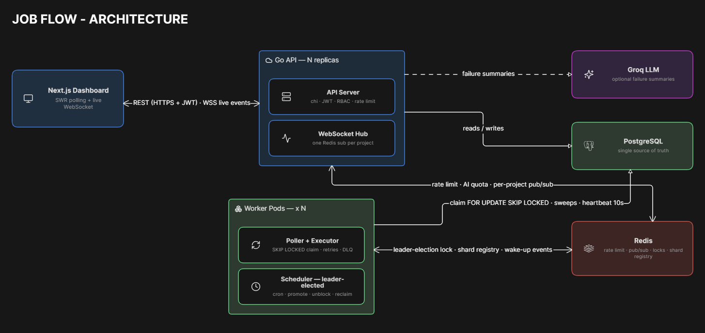
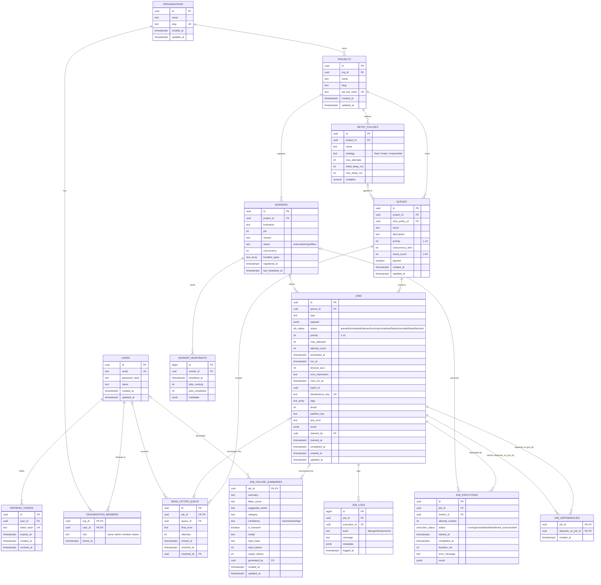

# JOB-FLOW

A distributed job scheduler that keeps thousands of background jobs running exactly
once, on time, and in the right order - powered by leader-elected cron scheduling,
Redis-backed rate limiting and distributed locks, rendezvous-hashed queue sharding,
DAG-aware workflow dependencies, and a live WebSocket-driven dashboard.


**Stack**

- **Go** - API server & worker runtime
- **Next.js** - real-time operator dashboard
- **PostgreSQL (Neon)** - durable source of truth
- **Redis (Upstash)** - rate limiting, pub/sub, distributed locks, shard registry
- **Chi** - HTTP routing & middleware chain
- **JWT** - stateless auth & RBAC
- **WebSocket** - live job/queue/worker events
- **golang-migrate** - schema migrations
- **Docker** - containerized builds & deploys
- **Groq (LLM)** - AI-generated job failure summaries (optional)

Full REST/WebSocket API reference: **[API.md](API.md)**.

Design decisions and the alternatives they beat: **[Tradeoffs.md](Tradeoffs.md)**.

---

## Table of Contents

- [Quick Start](#quick-start)
- [System Architecture](#system-architecture)
- [Entity-Relationship Diagram](#entity-relationship-diagram)
- [How It Works](#how-it-works)


---

## Quick Start

**Requires:** Go 1.25+, Node 20+, and Docker (or an existing Postgres 16 + Redis 7,
e.g. Neon + Upstash).

**1. Clone and configure**
```bash
git clone <repo-url> && cd dis-job-queue
cp .env.example .env   # set DATABASE_URL, JWT_SECRET, PROJECT_ID
```

**2. Database + Redis** (pick one)
```bash
# a) local, automatic - leave DATABASE_URL/REDIS_URL at their .env.example
#    defaults; step 4 starts Postgres/Redis via Docker for you
# b) fully containerized - everything, incl. Postgres/Redis, in containers
docker compose up
# c) remote - point DATABASE_URL/REDIS_URL at an existing instance
```

**3. Apply the schema** (first run only, skip for path b, it self-bootstraps)
```bash
./scripts/dev.sh --migrate
```
Needs the `migrate` CLI once:
`go install -tags 'postgres' github.com/golang-migrate/migrate/v4/cmd/migrate@latest`

**4. Run**
```bash
make dev
```
Go and npm packages install themselves on first run, nothing to do manually. Starts
the API (`:8080`), a worker, and the dashboard (`:3000`) in one terminal; Ctrl-C stops
everything.

```
   dis-job-queue dev 
   api    http://localhost:8080
   web    http://localhost:3000
   worker 1 x queues: default,email,notifications
  
```

**5. Verify API**
```bash
curl localhost:8080/health   
```
Then open `http://localhost:3000`.

### Variations

| Command | What it runs |
| --- | --- |
| `make dev` | API + worker + dashboard |
| `make dev-watch` | same, rebuilds/restarts Go services on any `.go` change |
| `make dev-api` · `make dev-worker` · `make dev-web` | a single service |
| `./scripts/dev.sh --workers 3` | three worker processes, same queues |
| `./scripts/dev.sh --migrate` | apply migrations before starting |
| `./scripts/dev.sh --kill-port` | free `:8080` / `:3000` if held |
| `PORT=8081 WEB_PORT=3001 make dev` | different ports |
| `docker compose up` | everything containerized, incl. Postgres/Redis |

`./scripts/dev.sh --help` lists every flag.

---

## System Architecture



### Layers, in order

| Layer | Role |
| --- | --- |
| **Clients** | The browser dashboard and any external API/CLI client speak the same authenticated REST API, there is no separate internal API. |
| **Frontend** (Next.js, `:3000`) | SWR polling for baseline freshness, plus a `useLiveEvents()` WebSocket that pushes targeted revalidations the moment something changes, so the UI updates in well under a second. |
| **API server** (Go, chi, `:8080`) | Stateless and horizontally scalable. Validates, authorizes, persists, and relays management operations; it never executes a job itself. |
| **`shared/` module** | Three contracts imported by both API and worker so they can never drift: `events` (Redis pub/sub), `lock` (`SET NX PX` + Lua CAS release, fencing tokens, auto-renewing `Guard`), `shard` (rendezvous-hashed ownership + TTL-pruned worker registry). |
| **Worker pool** (Go, N replicas) | Four concurrent subsystems per pod, poller, executor, scheduler, heartbeat, detailed in [How It Works](#how-it-works). |
| **PostgreSQL** (Neon) | Single source of truth for every durable fact: jobs, queue config, worker health, execution logs, DLQ entries, auth tokens, AI summaries. Survives a full Redis loss with zero data loss. |
| **Redis** (Upstash) | Deliberately narrow and disposable: rate-limit counters, event bus, distributed locks, shard registry, AI quota. Every use is advisory or self-healing, so correctness is readable from Postgres alone. |
| **Groq LLM** (optional) | Called only from `POST /jobs/{id}/failure-summary`, and only when `GROQ_API_KEY` is set. |

---

## Entity-Relationship Diagram



### Design rationale

**Normalization.** Third normal form. `retry_policies` is split out of `queues` so one
policy can serve many; `jobs` (state), `job_executions` (one row per attempt), and
`job_logs` (many per attempt) stay separate because their write rates and retention
differ. `job_dependencies` is a join table over `jobs` with
`CHECK (job_id <> depends_on_job_id)`, making a self-dependency impossible in the
database rather than only in code.

**Primary keys.** `UUID` (`gen_random_uuid()`) everywhere, except `worker_heartbeats` and
`job_logs`, which use `BIGSERIAL` for cheap appends and chronological order, and
`organization_members` / `job_dependencies`, which use composite keys because the pair
itself is the row's identity.

**Foreign keys.** `CASCADE` where the child is meaningless without its parent, so
deleting an org clears everything beneath it with no orphans. `SET NULL` where only
attribution is lost: `queues.retry_policy_id` (the queue keeps running on the default
back-off), `jobs.claimed_by`, `job_executions.worker_id`,
`dead_letter_queue.resolved_by`, `job_failure_summaries.generated_by`.

**Indexes.** Partial wherever the predicate allows, so they stay small no matter how many
millions of finished rows pile up behind them.

| Index | Serves |
| --- | --- |
| `idx_jobs_poll` on `(queue_id, shard, run_at, priority DESC) WHERE status='queued'` | the poller's `SKIP LOCKED` claim, on every tick |
| `idx_jobs_reclaim` on `claimed_at WHERE status IN ('claimed','running')` | the stuck-claim sweep, without a table scan |
| `idx_jobs_scheduled` · `idx_jobs_batch` · `idx_jobs_status` | promotion sweep · batch lookup · dashboard filters |
| `idx_executions_job` · `idx_logs_job` · `idx_workers_live` · `idx_dlq_pending` | job detail page · live workers · DLQ inbox |

**Performance.** `jobs.status` is a Postgres `ENUM`: smaller on disk than `TEXT`, and a
constraint that cannot drift. Partial indexes trade a little write overhead for one that
stays hot as the table takes the shape a job queue always takes, a small live working set
on top of a large cold archive.

---

## How It Works

PostgreSQL is the single source of truth; Redis holds only coordination state that is
advisory, reconstructible, or both. The entire Redis key space can be flushed without
losing a single job, and operators reason about correctness from one relational database
instead of reconciling two stores.

### Resource Hierarchy

```
Organization -> Project -> Queue -> Job
```

An **Organization** groups teams or customers. A **Project** namespaces work within one
org and carries its own API key. A **Queue** carries the scheduling configuration:
priority, concurrency limit, an optional retry policy, an optional shard count. A **Job**
is the unit of work: a JSON payload, a priority (1-10, higher runs first), an optional
idempotency key, an optional set of upstream dependencies, and a status advancing through
the [lifecycle FSM](API.md#job-status-fsm).

### Authentication & Authorization

`POST /auth/login` returns a short-lived JWT access token plus a long-lived rotating
refresh token persisted in Postgres, so it can be revoked server-side. Every protected
route re-derives the caller's role for that specific resource from `organization_members`
on each request (the full four-role model is in
[API.md](API.md#authorization-rbac)), so removing someone from an organization takes
effect on their very next request rather than at token expiry.

Requests pass through the chi middleware chain in order: **Recoverer** (a panic becomes a
`500`, not a dead process), **RequestID**, **Logger** (with the WebSocket `?token=`
parameter redacted), **CORS** (an origin allowlist, not a wildcard), the **rate limiter**
(Redis sliding window, 200 req/min per IP, ahead of auth so unauthenticated abuse is shed
at the edge), **JWT auth**, then the per-route **RBAC** check. Handlers share one
`pgxpool`, bounding open connections regardless of request concurrency.

### Job Lifecycle (Status FSM)

```
scheduled --(due)--> queued --(claimed)--> claimed --(handler starts)--> running
                        ^                                                    |
     blocked --(deps completed)--+                                          |
                                                                              v
queued/scheduled/blocked --(cancel)--> cancelled                completed / failed / dead
blocked --(upstream job died permanently)--> cancelled
failed --(attempts remain)--> queued  ·  failed --(attempts exhausted)--> dead
```

| Status | Meaning |
| --- | --- |
| `scheduled` | Future-dated, or a cron job waiting for its next tick |
| `blocked` | Waiting on one or more incomplete `depends_on` jobs |
| `queued` | Eligible for claim right now |
| `claimed` | Reserved by a worker (`FOR UPDATE SKIP LOCKED`), not executing yet |
| `running` | Executing inside a worker goroutine under its `timeout_secs` deadline |
| `completed` | Finished successfully (a cron job is immediately re-armed to `scheduled`) |
| `failed` | Errored with attempts remaining; requeued after a back-off delay |
| `dead` | Attempts exhausted; a `dead_letter_queue` row is written in the same transaction |
| `cancelled` | User-cancelled, or auto-cancelled because a dependency reached a terminal failure |

Every transition is written inside the same transaction that claims or closes the job, so
a job's status and its side effects (a DLQ row, an execution row) can never disagree.

### Worker Pods

Each pod is an independent Go process running four subsystems concurrently.

- **Poller.** One `UPDATE ... FOR UPDATE SKIP LOCKED RETURNING` claims as many jobs as
  the executor has free slots. The predicate is shard-aware and dependency-aware
  (`NOT EXISTS` an incomplete upstream) in that same statement, so a job can never start
  early even if its `blocked` bookkeeping lags. `SKIP LOCKED` is the entire concurrency
  mechanism: Postgres grants a contended row to exactly one pod and the rest move on, no
  application-level locking and no broker.
- **Executor.** One goroutine per job, under a concurrency semaphore and a per-job
  `context.WithTimeout`. A failure with attempts left requeues on the queue's back-off
  (fixed, linear, or exponential, capped at `max_delay_ms`); the final attempt writes
  `dead` plus a `dead_letter_queue` row in one statement.
- **Scheduler.** Leader-elected per project via `shared/lock`, sweeping every five
  seconds: promote due jobs, arm the next cron run, unblock satisfied dependencies,
  cancel jobs whose upstream died permanently, reclaim claims stuck past a grace period.
  Every statement is idempotent, so losing Redis only means the sweep runs unguarded on
  every pod.
- **Heartbeat.** A `worker_heartbeats` row every ten seconds (hostname, PID, running and
  completed counts). `/workers` and `active_workers` count a pod as live only if its
  heartbeat is under two minutes old.

### Queue Sharding, Locking, and Events

- **Sharding.** `shard_count` (1-64, default 1) splits a queue across the pool by
  rendezvous hashing rather than a fixed modulo, so adding or removing a worker
  reshuffles the fewest possible assignments.
- **Degraded modes.** Shard ownership lives in a TTL'd Redis set refreshed on each
  heartbeat. If Redis is unreachable a worker claims *every* shard rather than none, and
  the scheduler runs unguarded rather than stalling, since `SKIP LOCKED` still rules out
  duplicate execution. Both are contention optimizations, never correctness mechanisms.
- **Events.** Every state-changing write (`job.enqueued`, `job.completed`,
  `queue.paused`, and so on) is published to a per-project Redis channel. Workers
  subscribe to nudge their own poller, cutting enqueue-to-pickup from `POLL_INTERVAL` to
  milliseconds, with the ticker still there as the safety net. The WebSocket hub
  subscribes the same way to push identical events to the dashboard (see
  [Live Events](API.md#live-events-websocket)), with polling as the fallback.

### AI Failure Summaries

`POST /jobs/{id}/failure-summary` sends the job's type, payload, error history, and
recent logs to Groq under a JSON schema, so `category`/`confidence` cannot drift from the
table's `CHECK` constraints. Results are cached by a SHA-256 fingerprint of the evidence,
so the same failure never pays twice, and generation is guarded by a distributed lock and
a per-project hourly quota. Optional: with no `GROQ_API_KEY` the endpoint returns `503`
and `GET /features` reports `ai_failure_summaries: false`, so the dashboard hides it.

### Data Storage

Postgres holds all durable state, schema-managed by versioned migrations in
`db/migrations/` applied in order by `golang-migrate`; the
[ER diagram](#entity-relationship-diagram) covers the tables and index rationale. Redis
holds only rate-limit counters, the pub/sub bus, lock keys, the shard registry, and the
AI-summary quota counter.
