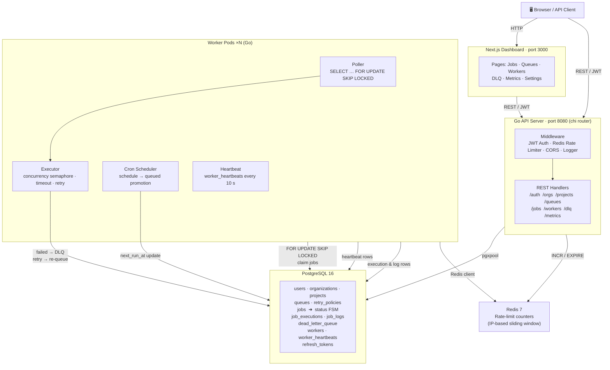

# dis-job-queue

A distributed job queue system with priority scheduling, retry policies, cron support, dead-letter queue, and a real-time dashboard.

---

## System Architecture

---

## How It Works

The system is organized into four distinct layers that communicate through PostgreSQL as the single source of truth. A client — either the Next.js dashboard or any HTTP consumer — authenticates against the Go API server using JWT tokens issued on login; refresh tokens are persisted in PostgreSQL and Redis is used solely for a sliding-window rate limiter that caps each IP at 200 requests per minute. Once authenticated, clients interact with a resource hierarchy of Organizations → Projects → Queues → Jobs: jobs are inserted into the `jobs` table with a `status` of `queued` (or `scheduled` for future-dated work), carrying a JSON payload, a priority value between 1 and 10, configurable retry limits, an optional idempotency key to prevent duplicates, and an optional cron expression for recurring execution. On the processing side, one or more Worker pods connect directly to PostgreSQL and run a tight polling loop that issues `SELECT … FOR UPDATE SKIP LOCKED` — a lock-free, race-safe pattern that lets any number of workers compete for jobs without stepping on each other. Each claimed job is handed to the Executor, which enforces per-job timeouts and a concurrency semaphore so a single worker never exceeds its configured parallelism limit. If a job fails, the Executor applies the queue's retry policy — fixed, linear, or exponential back-off — and re-queues it up to the configured maximum attempts; once all attempts are exhausted the job row is marked `dead` and a corresponding `dead_letter_queue` record is written, from which operators can inspect, retry, or discard from the dashboard. A separate Cron Scheduler goroutine inside each worker wakes every five seconds to promote due `scheduled` jobs to `queued` and to compute the next `run_at` for any recurring cron job. Workers also emit a heartbeat row every ten seconds so the API can report live worker health and detect stale processes. All structural changes — schema, indexes, triggers — are managed through versioned SQL migrations in `db/migrations/`, and the entire stack is wired together via `docker-compose.yml` with hot-restart policies and health checks on both PostgreSQL and Redis.
