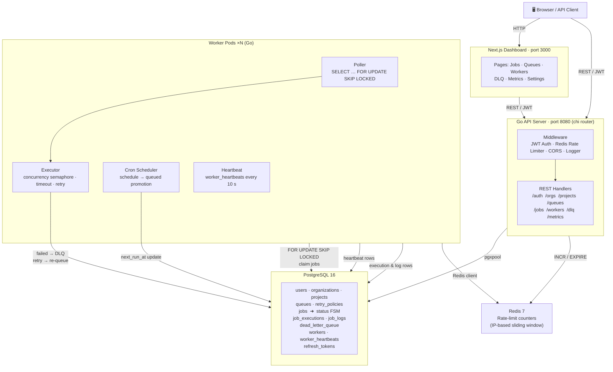

# dis-job-queue

A distributed job queue system with priority scheduling, retry policies, cron support, dead-letter queue, and a real-time dashboard.

---

## System Architecture



---

## How It Works

### Design Philosophy

PostgreSQL is the single source of truth for every piece of durable state in the system — job records, queue configuration, worker health, execution logs, dead-letter entries, and auth tokens all live there. Redis is intentionally kept narrow: it holds only ephemeral rate-limit counters and is never used as a primary store. This choice means the system survives a Redis restart with no data loss, and operators can reason about system state by querying a single relational database rather than reconciling two stores.

---

### Resource Hierarchy

Everything in the system is scoped to a multi-tenant hierarchy:

```
Organization → Project → Queue → Job
```

An **Organization** groups related teams or customers. A **Project** belongs to one organization and acts as a logical namespace for work. A **Queue** belongs to a project and carries the scheduling configuration — concurrency limits, retry policies (fixed / linear / exponential back-off), max attempts, and an optional cron expression for recurring execution. A **Job** is the unit of work: it belongs to a queue, holds a JSON payload, a numeric priority (1–10, where lower numbers run first), an optional idempotency key, and a status that advances through the job lifecycle FSM.

---

### Authentication & Authorization

Clients authenticate by posting credentials to `POST /auth/login`. The API issues a short-lived JWT access token (signed with a server secret, carrying the user's ID and organization membership) and a long-lived refresh token. Refresh tokens are stored in the `refresh_tokens` table in PostgreSQL so they can be revoked server-side; the JWT itself is stateless and validated on every protected request by the JWT middleware layer. Every API route downstream of the middleware receives a verified identity, and resource access is scoped so a user in organization A cannot read or modify jobs belonging to organization B.

Redis enforces a sliding-window IP-level rate limit (200 requests per minute per IP address) via atomic `INCR` / `EXPIRE` operations. This sits in the middleware chain before auth, so even unauthenticated abuse is shed at the edge.

---

### API Server

The Go API server runs on port 8080 using the `chi` router. Requests pass through a middleware stack in this order:

1. **Logger** — records method, path, latency, and response code.
2. **CORS** — sets appropriate headers for the frontend origin.
3. **Redis Rate Limiter** — rejects requests exceeding the per-IP sliding-window threshold.
4. **JWT Auth** — validates the bearer token and injects the identity into the request context.

After the middleware stack, requests reach typed REST handlers organized by resource: `/auth`, `/orgs`, `/projects`, `/queues`, `/jobs`, `/workers`, `/dlq`, and `/metrics`. Handlers talk to PostgreSQL through a `pgxpool` connection pool, which manages a bounded set of connections and reuses them across concurrent requests without exhausting database connection slots.

The API never executes jobs itself. Its role is to accept job submissions, serve state queries, expose metrics, and relay management operations (requeue from DLQ, drain a queue, update retry policy). Execution is entirely the responsibility of worker pods.

---

### Job Lifecycle (Status FSM)

A job moves through the following states:

```
queued → running → succeeded
                ↘ failed → (retry) → queued
                         → (max attempts exhausted) → dead
scheduled → queued  (promoted by cron scheduler)
```

- **queued** — ready to be picked up by a worker.
- **scheduled** — a future-dated or recurring job waiting for its `next_run_at` time.
- **running** — claimed by a specific worker; the `job_executions` row is open.
- **succeeded** — executor reported a successful result; execution row is closed with duration and output.
- **failed** — executor reported an error; retry policy is consulted.
- **dead** — all retry attempts exhausted; a `dead_letter_queue` row is written and the job is removed from normal processing.

State transitions are written as atomic updates inside the same PostgreSQL transaction that claims or closes the job, so there is no window in which a job is in an ambiguous state.

---

### Worker Pods

One or more worker pods run as independent Go processes (or containers). Each pod contains three concurrent subsystems:

#### Poller + Executor

The Poller runs a tight loop issuing:

```sql
SELECT id, payload, priority, queue_id, ...
FROM jobs
WHERE status = 'queued'
  AND queue_id = $1
  AND next_run_at <= NOW()
ORDER BY priority ASC, created_at ASC
FOR UPDATE SKIP LOCKED
LIMIT $2
```

`FOR UPDATE SKIP LOCKED` is the key concurrency mechanism. When multiple worker pods race for the same row, Postgres grants the lock to exactly one of them and the others silently skip that row and move to the next. No application-level locking, no queue table in Redis, no external coordinator — the database itself serializes job acquisition with no wasted round trips.

Claimed jobs are handed to the **Executor**. The Executor runs each job inside a goroutine and enforces two limits simultaneously:

- **Concurrency semaphore** — a buffered channel that limits how many jobs a single worker runs in parallel, preventing a burst of high-latency jobs from monopolizing all goroutines.
- **Per-job timeout** — a `context.WithTimeout` wraps each job's execution. If the handler does not complete within the configured window the context is cancelled, the job is marked failed, and the retry policy is applied.

If a job fails and attempts remain, the Executor writes a failed `job_executions` row (recording the error message and duration), increments `attempt_count` on the job row, computes the next retry delay according to the queue's back-off policy, and sets `status = 'queued'` with an updated `next_run_at`. If all attempts are exhausted, the job is moved to `dead` and a `dead_letter_queue` record is inserted in the same transaction, capturing the final error, payload, and full execution history for operator review.

#### Cron Scheduler

A separate goroutine inside each worker pod wakes on a five-second tick. It scans the `jobs` table for rows where `status = 'scheduled'` and `next_run_at <= NOW()`, promotes each to `status = 'queued'`, and immediately computes the next `next_run_at` from the job's cron expression for recurring jobs. The promotion is a single `UPDATE … WHERE status = 'scheduled' AND next_run_at <= NOW()` with `FOR UPDATE SKIP LOCKED`, so multiple worker pods can run the scheduler concurrently without double-promoting the same job.

#### Heartbeat

Each worker emits a `worker_heartbeats` row every ten seconds containing its hostname, process ID, and a timestamp. The API reads these rows when serving the `/workers` endpoint, so the dashboard can display which workers are alive, how many jobs each is currently running, and flag any pod whose last heartbeat is stale (indicating a crash or network partition). Workers also register themselves in a `workers` table on startup and deregister on clean shutdown; the heartbeat mechanism catches ungraceful exits.

---

### Frontend Dashboard

The Next.js app on port 3000 serves five main views:

| View | Purpose |
|---|---|
| **Jobs** | Browse, filter, and inspect individual job records; view execution logs and retry history. |
| **Queues** | Create and configure queues; adjust concurrency, retry policy, and cron schedule. |
| **Workers** | Live view of registered worker pods and their heartbeat timestamps. |
| **DLQ** | Inspect dead-letter entries; requeue or discard failed jobs. |
| **Metrics** | Throughput charts, failure rates, queue depth over time, and worker utilization. |
| **Settings** | Manage organizations, projects, API keys, and user access. |

The dashboard communicates with the Go API over authenticated REST. It does not talk to PostgreSQL or Redis directly — all reads and writes go through the API layer, which enforces auth and rate limiting uniformly for both browser and programmatic clients.

---

### Data Storage

#### PostgreSQL 16

All durable state lives in PostgreSQL. The schema is managed through versioned SQL migration files in `db/migrations/`, applied in order. Key tables:

| Table | Role |
|---|---|
| `users`, `organizations`, `projects` | Multi-tenant identity and scoping. |
| `queues`, `retry_policies` | Queue configuration and back-off rules. |
| `jobs` | Central job table; carries status, payload, priority, cron expression, attempt counters, and timestamps. |
| `job_executions` | One row per execution attempt; records start/end time, outcome, and error message. |
| `job_logs` | Structured log lines emitted by job handlers during execution. |
| `dead_letter_queue` | Terminal failure records for operator review. |
| `workers`, `worker_heartbeats` | Worker registration and liveness tracking. |
| `refresh_tokens` | Persisted refresh tokens enabling server-side revocation. |

Indexes on `(status, next_run_at, priority)` keep the poller query fast even under heavy load. A partial index on `status IN ('queued', 'scheduled')` avoids scanning terminal rows.

#### Redis 7

Redis stores only rate-limit counters — one key per IP address, with a TTL equal to the sliding window (60 seconds). No job state, no locks, no pub/sub. The entire Redis key space can be flushed without losing a single job.

---

## UI / Frontend Design

> This section tracks dashboard UI decisions, what has been built, and what needs to be done next. Pick up here when resuming frontend work.

---

### Design Direction — Railway Departure Board

The operator dashboard uses a **Railway Departure Board** visual world. The core thesis: queues are platforms, jobs are departures — the operator reads system health the same way a traveller reads an arrivals board. Status is the only decoration that matters; every pixel that isn't data is removed.

This direction was chosen over the category default (sidebar nav + metric cards + Inter/Tailwind table) because the product is a scheduling system and the metaphor is load-bearing, not decorative.

**Visual commitments (binding — do not change without a full redesign round):**

| Token | Value | Role |
|---|---|---|
| Ground | `#0d1117` | Page background |
| Surface | `#161b22` | Nav, elevated panels |
| Surface-2 | `#21262d` | Hover states, sub-borders |
| Border | `#30363d` | Dividers |
| Text-1 | `#e6edf3` | Primary labels |
| Text-2 | `8b949e` | Secondary / metadata |
| Text-3 | `#484f58` | Column headers, dim values |
| Running | `#3fb950` | Healthy state only |
| Degraded | `#d29922` | Warning / stalled state only |
| Critical | `#f85149` | Dead-letter / failure only — **never reassigned to another meaning** |
| Paused | `#6e7681` | Paused/inactive |

**Typography (binding):**
- **Barlow Condensed 700** — all UI chrome: nav wordmark, breadcrumbs, column headers, status badges, button labels
- **JetBrains Mono 400/500** — all data: counts, rates, timestamps, dead-letter numbers
- Avoid Inter as a primary workhorse. Avoid Geist. Both are flagged in PRODUCT.md as brand anti-patterns.

**Theme:** Single dark theme only. Departure boards are backlit; no light-mode toggle is planned or appropriate for this product.

---

### Homepage — Operator Dashboard

**Artifact (live preview):** `https://claude.ai/code/artifact/15e6279d-ca73-4103-82a4-e738150242a6`

**Source file:** `/tmp/claude-1000/…/scratchpad/dashboard-homepage.html`
(Copy this into the actual frontend when wiring up Next.js components.)

**What is built:**

| Section | Description |
|---|---|
| **Sticky nav** (52px) | Wordmark left, org → project breadcrumb (MERIDIAN LABS › PAYMENTS PIPELINE), Live dot + Workers count + New Job CTA right. `position: sticky; top: 0; z-index: 100`. |
| **KPI strip** | 4-column grid: Active Jobs, Workers Alive, Throughput (/min), Critical (red when > 0). Large JetBrains Mono numerals, small Barlow Condensed labels. Live-updates every 2.5 s. |
| **Needs Attention** | Conditional amber-tinted section. Shows queues with `status: wrn` or `status: crt` with a one-line diagnosis and an Inspect button. Hidden when all queues are healthy. |
| **Departure board table** | Full-width table. Columns: Queue (name + meta), Status (badge), Running, Queued, Dead, Throughput (sparkline + rate), Last Run, Workers. Sticky thead at `top: 52px`. Warning rows carry a 1px amber left border; critical rows carry a 1px red left border. |
| **Inline SVG sparklines** | 72×20px polyline per queue, color-matched to status. Flat dashed line when throughput is zero. |
| **Live simulation** | `setInterval` at 2 500 ms. Running counts vary ±1 randomly; rates vary ±2; sparkline arrays shift/push. Flash animation (green tint) on count increases. |
| **Responsive breakpoints** | ≤ 768px: KPI strip → 2-col, attention message hidden, sparkline and timestamp columns hidden. ≤ 440px: non-active breadcrumb crumbs hidden. |

**Synthetic data used (Meridian Labs / Payments Pipeline):**

| Queue | Status | Notes |
|---|---|---|
| email-dispatch | Running | High throughput (42/min baseline) |
| fraud-detection | Running | Medium throughput |
| invoice-generation | Degraded | Workers stalled, 23 queued |
| payment-webhook | Critical | 2 in dead-letter, 0 workers |
| notification-hub | Paused | 47 queued, dormant |
| settlement-batch | Running | Cron — daily 02:00 UTC |
| audit-export | Running | Cron — hourly |

---

### Known Issues to Fix

**1. Sticky thead renders above first data row (visual overlap)**

- **Symptom:** When the page scrolls slightly, the `EMAIL-DISPATCH` queue name label appears above the `QUEUE / STATUS / …` column header row in the viewport.
- **Root cause (investigated):** `position: sticky` on `thead th` with `top: 52px` is correct in isolation. The overlap is caused by how the artifact viewer's iframe scroll context interacts with the sticky threshold. When the tbody first row scrolls partially past the stuck thead, the top ~18 px of the row (above `top: 52px`) is visible between the nav bottom and the column header. The nav's `z-index: 100` should cover it but the background color mismatch between nav (`--g1 #161b22`) and the board area (`--g0 #0d1117`) creates a gap.
- **Fix tried:** Changed `border-collapse: collapse` → `border-collapse: separate; border-spacing: 0` and replaced `border-bottom` on thead with `box-shadow: inset 0 -1px 0 var(--bd)`. Did not fully resolve.
- **Recommended next approach:**
  1. Give the nav `background: var(--g0)` (match ground color) so there's no visible seam when content scrolls behind it, OR
  2. Add a `padding-top` shim on `.board-wrap` equal to the nav height so the board never scrolls under the nav at all, OR
  3. Change the board to use an internal scroll container (`max-height: calc(100dvh - 52px - <kpi+attn height>); overflow-y: auto` on `.board-wrap`) so the sticky thead is relative to that container and never competes with the page scroll. This is the cleanest long-term solution for a dashboard with many queues.

**2. Responsive mobile view not fully verified**

- The `≤ 768px` breakpoints are defined in CSS but the mobile screenshot could not be captured in the review session (browser resize to 390 px width didn't apply to the artifact iframe).
- Before shipping, test at 390 px (iPhone 14 Pro) and 768 px (iPad) and verify: KPI shows 2-col, attention rows readable, board scrolls horizontally without body overflow.

**3. Live simulation rate drift**

- The random walk on `rate` (±2 per tick, unclamped above) can drift rates far from baseline over a long session. Add a mean-reversion clamp: `q.rate = Math.max(0, Math.min(q.rate + rd, q.baseRate * 1.5))` where `baseRate` is the initial value.

---

### Next Steps for UI Work

When resuming, pick up in this order:

1. **Fix the sticky thead issue** — try the internal scroll container approach on `.board-wrap` (option 3 above). Test by scrolling the board with many queues.
2. **Wire to real API** — replace the `const Q = [...]` array and the `tick()` simulation with `fetch('/api/queues?project_id=…')` polling (or SSE stream). The DOM structure is already keyed by queue ID (`id="row-${q.id}"`, `id="run-${q.id}"`, etc.) so partial updates are straightforward.
3. **Inspect drawer** — clicking a queue row or the Inspect button should open a right-side drawer showing job list, execution log, retry history for that queue. This is the main navigation the board needs.
4. **New Job modal** — the `+ NEW JOB` button in the nav should open a modal: queue selector, payload textarea, priority slider, optional scheduled time.
5. **Empty state** — when no queues exist yet, show an onboarding callout inside the board area prompting the user to create their first queue.
6. **DESIGN.md** — write the canonical design system file from the built artifact so all future surfaces can inherit the token system and type rules. Run `/impeccable document` once the sticky issue is fixed and the artifact is clean.

---

### Operational Wiring

The full stack is defined in `docker-compose.yml`. Each service declares a `healthcheck` so dependent services wait for real readiness rather than just TCP connectivity — the API waits for PostgreSQL to accept queries, and workers wait for the API before registering. All services are configured with restart policies so a crashed pod comes back automatically in development and staging environments.

Migrations run as a one-shot init container before the API starts, ensuring the schema is always up to date before any handler touches the database.


Upcoming Main UI work -
Don't use a single template. The approach that gets you full marks is a layered strategy: one repo for the shell, one library for the data visualization, and one source for component-level polish. Here's the exact combination:

Layer 1 — Shell & Structure
Kiranism/next-shadcn-dashboard-starter

github.com/Kiranism/next-shadcn-dashboard-starter

This is a free, open source (MIT) admin dashboard starter built with Next.js 16, shadcn/ui, Tailwind CSS v4, and TypeScript. It has 5,500+ GitHub stars, which signals legitimacy to any interviewer who checks. 
GitHub
Starterindex

Why this one over every other template: most dashboard templates are static demo boilerplates — screens that look finished but need rebuilding the moment you wire in real data. This starter takes the opposite approach. Tables run end-to-end against a real data layer. Forms validate and mutate with cache invalidation. Auth, organizations, and billing function end-to-end. 
Shadcn Dashboard

What you get out of the box that maps directly to your assignment requirements:

Pre-built admin dashboard layout (sidebar, header, content area), analytics overview page with charts and cards, data tables with React Query prefetch, client-side cache, search, filter and pagination, and an RBAC navigation system — fully client-side navigation filtering based on organization, permissions, and roles. 
GitHub
Kanban board (drag-and-drop task management built with dnd-kit), Command+K interface via kbar, feature-based code organization, ESLint + Prettier with Husky pre-commit hooks. 
Publicrepo
AI chat integration, notifications center, and a theme system with selector and mode toggle. 
GitHub

What to remap to your scheduler domain: the "Products" table → Jobs table. The "Users" table → Workers table. The Kanban board → Queue management. The analytics overview → Throughput/metrics dashboard. The RBAC system → Project-level access control. You're not rebuilding — you're renaming and rewiring.

Layer 2 — Data Visualization
tremorlabs/tremor

github.com/tremorlabs/tremor · tremor.so

This is the missing piece every other dashboard template lacks for a monitoring use case. Tremor offers 35+ fully open-source, accessible components for dashboards and charts, built with React, Tailwind CSS and Radix UI. It includes Tracker, Bar Lists, and many more components to visualize complex use cases gracefully, plus micro visualizations to highlight even the smallest details better. 
Tremor

Charts are hard, so Tremor already pushed the pixels so you can focus on data. It includes modular lists and tables that go along with badges, icons, or visualization elements, and powerful filter components for better interaction with your data. 
Tremor NPM

For your scheduler specifically, the Tremor components that will make your UI look like a real SaaS product are:

AreaChart → job throughput over time (jobs/minute)
DonutChart → job status breakdown (queued / running / completed / failed)
Tracker → worker heartbeat timeline — this is the one that makes it look like a real monitoring tool
BarList → queue priority visualization
KPI Cards with sparklines → total jobs today, success rate, avg execution time, active workers

Tremor + shadcn/ui don't conflict. Tremor handles the data visualization; shadcn handles everything structural (tables, dialogs, badges, dropdowns). They live in the same Tailwind project with no friction.

Layer 3 — Polish & Animation
magicui.design + ui.aceternity.com

Use these selectively for 3–5 components that make the UI feel alive without being gimmicky:

From Magic UI (magicui.design):

AnimatedNumber — for the job count KPI cards, numbers animate up on load. One line of code, huge visual impact.
Shimmer Button — for the "Run Job Now" CTA.
Sparkles — for success state animations.

From Aceternity UI (ui.aceternity.com):

Moving Border — for the active worker cards to show they're alive.
Background Beams — for the login/auth page only (not the dashboard itself — overuse kills the effect).

Keep these to the landing/auth page and 2–3 dashboard elements max. Overuse signals junior thinking. Surgical use signals taste.

Exact Pages to Build and What They Map To
Assignment Requirement	Dashboard Page	Key Components
Queue management	/queues	shadcn Table + Tremor DonutChart + pause/resume toggles
Job explorer	/jobs	TanStack Table (already in Kiranism) + status badges + filters
Worker monitor	/workers	Tremor Tracker for heartbeat + status cards
Execution logs	/jobs/[id]/logs	shadcn ScrollArea + code-style log viewer
Metrics / throughput	/metrics	Tremor AreaChart + BarList + KPI cards
Queue config	/queues/[id]/settings	React Hook Form + Zod (already in Kiranism)
DLQ / retry	/dlq	shadcn Table + retry action buttons
Auth / projects	/login, /projects	Already built in the Kiranism starter
The Setup Order
bash
# 1. Clone the base
git clone https://github.com/Kiranism/next-shadcn-dashboard-starter.git
cd next-shadcn-dashboard-starter

# 2. Install Tremor
npx shadcn@latest add "https://tremor.so/ui/area-chart"
npx shadcn@latest add "https://tremor.so/ui/donut-chart"
npx shadcn@latest add "https://tremor.so/ui/tracker"
npx shadcn@latest add "https://tremor.so/ui/bar-list"
npx shadcn@latest add "https://tremor.so/ui/kpi-card"

# 3. Add Magic UI selectively
npx shadcn@latest add "https://magicui.design/r/animated-number"
npx shadcn@latest add "https://magicui.design/r/shimmer-button"

Everything installs into your components/ directory as source code you own — no black-box npm dependencies, which means no version conflicts and full customizability.